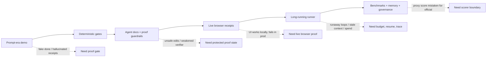

# NodeProof

**Bring any coding agent. NodeProof makes it prove the app works.**

Coding agents write code and say "done." NodeProof is the supervisor that decides whether done is
true: it runs a gate against your app, refuses false completion, captures which tools your agent
actually called, and keeps proof state the agent cannot quietly weaken. One prompt starts the loop;
the gate decides when it is actually done.

The CLI remains `npx proofloop` for package compatibility.

Zero runtime dependencies. Node >= 20. Works on any repo.

## Agent and Provider Interop

Codex and Claude Code can install local hook enforcement; other hosts are represented as adapter receipts until a launch, trace-capture, and gate-enforcement surface exists:

```bash
npx proofloop agents list
npx proofloop agents setup codex --local
npx proofloop agents setup claude-code --local
npx proofloop codex-loop --dry-run
```

Solo Founder Agent Builder can supply the self-directing RALPH workflow while NodeProof remains the
independent gate:

```bash
npx proofloop solo setup --source ../solo-founder-agent-builder --agent both --install-deps --verify
npm run sfn -- proofloop export --project . --out .solo/proofloop-interop.json --program-id my-program --goal-id my-goal --actor me --role owner --agent-host codex --tier local_ready --boundary product_path
npx proofloop solo ingest --file .solo/proofloop-interop.json --write-runner-plan
npx proofloop solo gate
```

The Solo verdict is advisory. Team and certification claims require independent receipts. See
`docs/solo-founder-interop.md` for the authority boundary, two-user flow, evidence-only CI commit,
signed artifact re-export, and public-repository privacy rules.

Provider setup receipts cover Butterbase, Neo4j, RocketRide, Daytona, Cognee, and Nebius without treating missing credentials as success:

```bash
npx proofloop providers setup all
```

See `docs/interoperability.md` and `docs/local-bench-setup.md` for LangChain/LangSmith/Harbor boundaries and local Finch, FinAuditing, and WorkstreamBench setup recipes.

## ProofLoop Live

`proofloop.live` is the managed-service intake for teams that want Proof Loop run against their app
without first becoming benchmark-infra experts: send a live URL or a codebase target, choose the
benchmark or proxy-task families, set a budget cap, and receive proof artifacts from the runner.

The public site is intentionally static. It creates a scoped run request and keeps the same honesty
boundary as the CLI: product-path proof, proxy benchmark proof, and official scorer output must be
labeled separately. It does not collect tokens or repository credentials in the browser.

The portable CLI now includes the local intake layer that service uses first:

```bash
npx proofloop hosted intake --url https://your-app.example --app-type agent-app --budget-usd 10 --consent
npx proofloop hosted run --request .proofloop/hosted/queue/<run-id>.json
npx proofloop target --url https://your-app.example --write-runner-plan
npx proofloop target --url https://your-app.example --write-browser-smoke --write-runner-plan
npx proofloop target --dir . --write-runner-plan
```

`hosted intake` creates the service packet: target URL, app type, auth/session notes, model budget,
consent, domain permission instructions, generic success criteria, benchmark proxy tasks, artifact
paths, dashboard HTML, and a queue item. `hosted run` resolves that packet into a managed-worker
plan. The worker is intentionally outside normal Vercel request limits because real runs need
long-running Playwright, model calls, retries, screenshots, video, traces, scorecards, and cost
ledgers.

On `proofloop.live`, `/api/hosted/submit` validates the packet and dispatches
`.github/workflows/hosted-proofloop.yml`. The GitHub Actions worker installs Playwright, runs
`scripts/hosted-worker.mjs`, and uploads the artifact contract as an Actions artifact. The live page
polls `/api/hosted/status?runId=...` for queue/running/completed state and replay/artifact links.
GitHub SSO is exposed through `/api/auth/github/start`, `/api/auth/github/callback`, and
`/api/auth/github/status`. Configure the Vercel deployment with
`PROOFLOOP_GITHUB_OAUTH_CLIENT_ID`, `PROOFLOOP_GITHUB_OAUTH_CLIENT_SECRET`, and optionally
`PROOFLOOP_AUTH_COOKIE_SECRET`; until those are present, the SSO button fails closed with an
unconfigured status instead of pretending sign-in works.

Hosted runs are blocked until the target is allowlisted or domain-verified through a well-known file
or DNS TXT token. Auth notes are notes only: do not paste raw passwords, API keys, or production
secrets into browser intake. Apps behind login use manual-login, test-account, or session-replay
handoff in the worker.

`target` fetches the live URL or scans the codebase, recommends benchmark families with evidence,
detects any already-configured benchmark/browser scripts, writes
`.proofloop/target/latest-target-plan.json`, and can write a runnable
`.proofloop/runner/target.plan.json`. It also writes a dated, LangChain-docs-style context page at
`.proofloop/reports/latest.md` for the next human or coding agent to read before continuing the run.
It does not invent official scores; missing adapters and official scorer paths are recorded as
blockers.

When `--write-browser-smoke` is provided with `--url` in a repo with `package.json`, Proof Loop
writes `proofloop/browser/live-smoke.spec.ts` and a `proofloop:live-smoke` package script. That turns
basic live URL rendering/clickability into a runnable Playwright task while keeping deeper app flows
and official benchmark scorers explicit.

## Agent-Era Maturity

ProofLoop can also judge where a repo or app sits in the agent era and report what is missing before
it can honestly claim a higher level of autonomy, benchmark readiness, or hosted proof coverage:

```bash
npx proofloop maturity --dense
npx proofloop maturity --target-level 5 --write
```

`maturity` scans local evidence such as gate checks, CI, agent instructions, protected proof state,
UI/tool contracts, browser tests, receipts, durable runners, budget/model tracking, hosted worker
surfaces, benchmark adapters, memory/session-mining signals, and governance boundaries. With
`--write`, it produces `.proofloop/reports/agent-era-maturity.md` plus a JSON receipt for the next
human, buyer, or coding agent.

| Level | Stage | What must be real |
|---:|---|---|
| 0 | Prompt-era demo | A prototype can exist, but done is still a claim. |
| 1 | Deterministic product proof | Build/test/lint/typecheck or an explicit ProofLoop gate exists. |
| 2 | Agent-ready repo | Agent instructions, CI backstop, and protected proof/verifier state exist. |
| 3 | Live app proof | Stable UI/tool contracts, browser verification, and receipts/artifacts exist. |
| 4 | Long-running proof loop | Resume, budget, model/cost tracking, hosted worker, status, permission, and dashboard boundaries exist. |
| 5 | Agent OS / benchmark-ready | Official scorers or judge contracts, model sweeps, memory mining, and governance approvals exist. |

The pattern we see across agent products is a capability reveal wave followed by a failure receipt
wave. Each new capability creates demand for a stricter control layer:



Projection is intentionally boring: move one proof layer at a time and keep proxy proof separate
from official benchmark output until the scorer path is real.

```mermaid
xychart-beta
  title "Agent-era maturity projection"
  x-axis ["Today", "Next release", "Target"]
  y-axis "Level" 0 --> 5
  line [4, 5, 5]
```

README diagrams use native Mermaid so they render on GitHub without another service. For richer
source diagrams, use Kroki in the build/rendering pipeline and commit the rendered output; do not
make the README depend on a live third-party renderer.

## Productivity Proof Pack

ProofLoop measures productivity as verified useful work, not agent activity. The default business
translation is wage-equivalent engineering/QA capacity, discounted by baseline confidence and gated
by proof:

```text
Verified Productivity =
  wage-equivalent human time saved
  + avoided rework / regression value
  + faster delivery value
  - model/API/browser/CI/review cost
```

The command is local and deterministic:

```bash
npx proofloop productivity \
  --write \
  --baseline-source benchmark \
  --dev-hours 3 \
  --qa-hours 1 \
  --human-review-hours 0.4 \
  --model-cost-usd 4.20 \
  --browser-cost-usd 0.50 \
  --ci-cost-usd 0.10 \
  --regression-added \
  --live-browser-verified
```

It writes:

```text
.proofloop/runs/<run-id>/
  productivity-ledger.json
  wage-research.json
  baseline-estimates.json
  productivity-scorecard.md
  charts/
    wage-equivalent-value.vl.json
    cost-per-passed-proof.vl.json
    time-to-proof-waterfall.vl.json
    regression-reuse-value.vl.json
    delivery-impact.vl.json
```

Every row used by the scorecard and charts carries `sourceFile`, `sourceField`, `confidence`,
`method`, and `citation`. No citation, no chart row. No passing proof, no confidence-adjusted
productivity claim.

Baseline confidence is explicit:

| Source | Default confidence | Use when |
|---|---:|---|
| `measured` | 0.95 | Timed human shadow run exists. |
| `historical` | 0.85 | Team PR/issue history supports the baseline. |
| `benchmark` | 0.75 | A task template or benchmark family supports the baseline. |
| `research` | 0.65 | External research supports the estimate. |
| `estimated` | 0.45 | Only an operator estimate exists. |

Default wage research uses cited public labor data as a fallback: [BLS May 2024 median annual
wages for software developers and software QA analysts/testers](https://www.bls.gov/ooh/computer-and-information-technology/software-developers.htm),
converted to hourly rates by dividing by 2,080 work hours. [DORA-style delivery
reliability](https://dora.dev/guides/dora-metrics-four-keys/) is tracked as separate dimensions
rather than collapsed into one magic number. [McKinsey's generative-AI productivity
analysis](https://www.mckinsey.com/capabilities/mckinsey-digital/our-insights/the-economic-potential-of-generative-ai-the-next-productivity-frontier)
and the [GitHub Copilot controlled study](https://arxiv.org/abs/2302.06590) are useful market
context, not guaranteed customer ROI.

## Quickstart

```bash
npx proofloop init --agent auto --live  # config + manifest + agent docs + scripts + live scaffold
npx proofloop doctor --json             # setup checks and fix commands
npx proofloop manifest --dense          # compact repo status for agents
npx proofloop ui contract --dense       # stable selectors/actions/assertions
npx proofloop target --write-runner-plan # benchmark plan + context report + runner discovery
npx proofloop maturity --target-level 5 --write # maturity report + missing layers
npx proofloop productivity --write --baseline-source benchmark # verified productivity pack
npx proofloop prompt                    # kickoff prompt to paste into your coding agent
npx proofloop this-repo --goal "proofloop my latest updates" --write-runner-plan
npx proofloop runner run --plan proofloop.runner.json --budget-usd 100
npx proofloop program run --plan proofloop.program.json --budget-usd 25
npx proofloop gate                      # run checks -> .proofloop/gate-state.json
```

Then make "done" honest for a Claude Code session:

```bash
npx proofloop hooks install
```

This installs a Stop hook that refuses to let the agent stop while the gate is failing, a PreToolUse
guard that blocks edits to proof/verifier state, and a PostToolUse logger for expected-tool-use
contracts. Uninstall with `proofloop hooks uninstall`.

Define the gate before installing hooks. Once hooks are installed, `proofloop.config.json` is itself
a protected path: the gate definition is not the agent's to move.

## Agent-Friendly Setup

`npx proofloop init --agent auto --live` follows the Astryx-style setup pattern:

- Writes `proofloop.config.json` if missing.
- Writes `.proofloop/manifest.json` with stack, commands, proof gates, workflows, UI contracts, and blockers.
- Adds or updates agent docs: `AGENTS.md`, `CLAUDE.md`, `.cursor/rules/proofloop.mdc`, and `.windsurf/rules/proofloop.md` when requested.
- Adds package aliases such as `proofloop:init`, `proofloop:gate`, `proofloop:resume`, and `proofloop:charts`.
- Creates live workflow/rubric starters under `proofloop/workflows/` and `proofloop/rubrics/`.

The CLI stays primary. `npx proofloop mcp` exposes the same compact read-only surfaces to MCP clients
without loading broad repo context.

ProofLoop also ships an Agent OS markdown pack under `docs/agent-os/`. It adapts the Room OS
human-world-model idea into deterministic proof supervision: goals are contracts, the world model is
the current target plus receipts/blockers, memory is mined from prior failures, and workers do not
grade their own work.

For a non-technical kickoff, tell Claude/Codex: "proofloop my latest repo" or
"proofloop my latest updates." The agent-facing command is:

```bash
npx proofloop this-repo --goal "proofloop my latest updates" --write-runner-plan
```

That writes `.proofloop/runner/latest-updates.plan.json` in two layers:

- Capability checks: headless build/test/typecheck/lint/gate tasks.
- Browser certification checks: discovered e2e/browser/Playwright/Cypress tasks.

Watch/dev/preview/server scripts are intentionally skipped; long-running services should be started
by your app-specific harness, not as proof tasks that never terminate.

Browser verification is not forced through every capability task. Use the local durable runner when
you want the CLI to execute the plan with append-only state, budget control, and resume:

```bash
npx proofloop this-repo --goal "proofloop my latest updates" --write-runner-plan --run --budget-usd 100
```

## Durable Program Supervisor (P0)

`proofloop program` coordinates a small dependency-safe program by invoking the existing durable
runner once per arc. It is intentionally not a second shell runner. Each arc points to an immutable
`proofloop-runner-plan-v1` subplan, runs sequentially after its dependencies pass, and may require a
locally verified ProofLoop receipt.

P0 admits only `read_only` and `proposal_only` arcs. Authority is a separate JSON file whose
canonical digest is pinned into durable program state. Any authority, program, or referenced runner
plan change blocks or fails the existing run rather than silently continuing. Explicit external
egress is rejected. Failed arcs are not automatically requeued; only an interrupted `running` arc
may recover through the existing runner's explicit stale-lock recovery path.

```json
// authority.json
{
  "schema": "proofloop-program-authority-v1",
  "authorityId": "overnight-read-propose-only",
  "allowedArcModes": ["read_only", "proposal_only"],
  "allowExternalEgress": false,
  "maxBudgetUsd": 25,
  "maxAttemptsPerArc": 1
}
```

```json
// proofloop.program.json
{
  "schema": "proofloop-program-plan-v1",
  "programId": "nodekit-ultra-v1",
  "authorityPath": "authority.json",
  "arcs": [
    {
      "id": "baseline",
      "mode": "read_only",
      "runnerPlan": "plans/baseline.runner.json"
    },
    {
      "id": "proposal",
      "mode": "proposal_only",
      "runnerPlan": "plans/proposal.runner.json",
      "dependsOn": ["baseline"],
      "receipt": { "kind": "proofloop-envelope", "file": "proof/proposal-receipt.json" }
    }
  ]
}
```

```bash
npx proofloop program run --plan proofloop.program.json --budget-usd 25
npx proofloop program resume --run-id latest
npx proofloop program status --run-id latest --json
npx proofloop program report --run-id latest
```

This is a local P0 safety boundary, not an OS sandbox. Runner subplans still require an execution
environment that independently enforces network, credential, browser, deployment, and publish
authority.

## How The Stop Gate Decides

- Default check-only mode reads `.proofloop/gate-state.json` with no subprocess or network call.
- `passed` allows stop.
- `failed` blocks stop and prints the failing checks.
- No verdict yet or `no_gate` allows stop with an honest note so fresh repos are not bricked.
- Command mode is opt-in: `proofloop hooks install --gate-command "<cmd>"`.
- A per-session block counter prevents infinite refusal loops.

## Protected Paths

The PreToolUse guard refuses agent file-edit tools for:

- `.proofloop/`: local proof state, hook scripts, counters, tool-use logs, charts, and receipts.
- `proofloop.config.json`: the gate definition.
- `.github/workflows/`: the CI backstop.
- Any repo-specific additions in `protectedPaths`.

It also scans attempted edits for verifier-weakening patterns such as disabling gates, lowering
thresholds, or skipping evidence.

Honest boundary: the guard intercepts agent file-editing tools, not raw shell writes. Use
`proofloop ci install github` so CI re-runs the gate from a clean checkout.

## Configuration

```jsonc
{
  "app": "Vite",
  "workflow": "user signs up, uploads a CSV, sees the chart",
  "gate": {
    "checks": [
      { "name": "build", "command": "npm run build" },
      { "name": "tests", "command": "npm test" },
      { "name": "e2e", "command": "npx playwright test" }
    ]
  },
  "immutable": ["scripts/verify.mjs"],
  "protectedPaths": ["data/golden/"]
}
```

With no checks configured, `proofloop gate` falls back to `npm test` when `package.json` has a test
script. With neither, it reports `no_gate` with exit code 2. An unconfigured gate is never a pass.

## Commands

| Command | What it does |
|---|---|
| `proofloop init` | Detect the app and write a starter `proofloop.config.json`. |
| `proofloop init --agent auto --live` | Add agent docs, manifest, package aliases, workflows, and rubrics. |
| `proofloop doctor [--json]` | Report node/git/agent readiness, manifest/docs/scripts, Playwright/browser readiness, GitHub workflow, UI contracts, and fix commands. |
| `proofloop manifest [--json\|--dense]` | Print project status: stack, commands, proof gates, workflows, UI contracts, blockers. |
| `proofloop target [--url <url>] [--write-runner-plan] [--write-browser-smoke] [--json]` | Recommend benchmark families from a URL/codebase, detect or scaffold configured adapters, and write target/runner plan receipts plus `.proofloop/reports/latest.md`. |
| `proofloop maturity [--dense\|--json\|--write] [--target-level 5]` | Report the codebase/app's agent-era maturity level, missing proof layers, next actions, and Mermaid progression/projection charts. |
| `proofloop productivity [--write] [--baseline-source <source>]` | Write a productivity ledger, wage research, baseline estimates, scorecard, and Vega-Lite charts for verified useful work. |
| `proofloop docs agents --dense` | Print compact agent workflow instructions. |
| `proofloop ui contract\|component <id>` | Discover stable `data-testid` and `data-proofloop` selectors. |
| `proofloop template --list` / `proofloop template <id> --write` | List or write starter proof-loop templates. |
| `proofloop workflow --list` | List local proof workflow files. |
| `proofloop resume [--json\|--dense]` | Read the latest gate receipt and print the next action. |
| `proofloop report latest [--json]` | Summarize the latest gate receipt. |
| `proofloop charts latest` | Write local JSON/SVG proof charts under `.proofloop/charts/`. |
| `proofloop receipt verify --file <path>` | Verify app-produced proof receipts such as NodeAgent ingestion receipts. |
| `proofloop receipt envelope verify --file <path>` | Verify a `proofloop.receipt/v1` envelope, authority semantics, and local content hashes. |
| `proofloop receipt schema [--json]` | Locate or print the packaged `proofloop.receipt/v1` JSON Schema. |
| `proofloop solo setup --source <repo> --agent both` | Install one canonical Solo skill for Codex and Claude Code and compose one Stop gate. |
| `proofloop solo ingest --file <envelope> --write-runner-plan` | Validate Solo evidence and optionally compile advisory tasks without executing them. |
| `proofloop solo status\|resume\|gate` | Inspect or enforce the NodeProof-derived Solo interop state. |
| `proofloop runner run --plan <file> --budget-usd 100` | Run an append-only, budgeted task plan under `.proofloop/runner/runs/<runId>/`. |
| `proofloop runner resume --run-id latest --clear-stale-lock` | Resume a runner after a crash; stale `running` tasks are requeued after explicit stale-lock clearance. |
| `proofloop runner status --run-id latest [--json]` | Inspect durable runner state and ledger paths. |
| `proofloop runner report --run-id latest [--json]` | Print the runner honesty report with per-family/per-model pass rate and estimated cost/pass. |
| `proofloop program run --plan <file> --budget-usd <n>` | Run a P0 read/proposal-only program as dependency-safe runner subplans under `.proofloop/programs/runs/<runId>/`. |
| `proofloop program resume --run-id latest` | Resume queued arcs, or explicitly recover an interrupted running arc through the runner. Authority or referenced-plan changes fail closed; failed arcs are not requeued. |
| `proofloop program status\|report --run-id latest [--json]` | Inspect the pinned authority digest, program state, arc statuses, budget, and ledger. |
| `proofloop mcp` | Start the optional read-only MCP server. |
| `proofloop gate [--check]` | Run configured checks or `npm test`; exit 0 pass, 1 fail, 2 unusable. |
| `proofloop hooks install\|uninstall\|status` | Install/remove/status Claude Code Stop, PreToolUse, and PostToolUse hooks. |
| `proofloop tooluse init\|verify` | Declare and verify expected-tool-use contracts. |
| `proofloop ci install github` | Install a GitHub Actions proof gate. |
| `proofloop prompt` | Print the canonical one-prompt kickoff. |
| `proofloop this-repo --live` | Run doctor/setup framing and print the local loop contract. |
| `proofloop this-repo --write-runner-plan [--run]` | Generate and optionally execute a two-layer durable runner plan for latest repo/latest updates. |
| `proofloop hosted intake --url <url> --app-type <type> --consent` | Write a hosted proof packet with consent, domain verification, success contract, benchmark proxy tasks, artifact paths, dashboard, and queue item. |
| `proofloop hosted run --request <queue-or-bundle.json>` | Convert a hosted packet into the external managed-worker plan that long-running Playwright/model infrastructure executes. |
| `node scripts/hosted-worker.mjs --request <request.json>` | Managed-worker entrypoint used by GitHub Actions to run Playwright and write receipt/screenshot/video/trace/scorecard/dashboard artifacts. |

Minimal runner plan:

```json
{
  "schema": "proofloop-runner-plan-v1",
  "tasks": [
    { "id": "unit-tests", "command": "npm test", "estimatedCostUsd": 0 }
  ]
}
```

## Expected-Tool-Use Contracts

If your agent takes real actions through tools such as Composio, MCP, or function calls, the gate can
assert it called required tools and never called forbidden ones:

```bash
npx proofloop tooluse init --template composio-email-triage
npx proofloop hooks install
# run your agent
npx proofloop tooluse verify --contract tooluse-contract.json
```

The verifier is fail-closed: a deny-list cannot be certified from an empty or missing log, and
server-pinned names mean `mcp__evil__X` cannot impersonate `mcp__composio__X`.

## App-Produced Receipts

Proof Loop can gate receipts emitted by app-specific harnesses without owning their internals. For
NodeRoom's two-pool document ingestion runner:

```bash
npm run nodeagent:ingestion:smoke
npx proofloop receipt verify \
  --file docs/eval/nodeagent-ingestion-orchestrator.json \
  --kind nodeagent-ingestion \
  --min-documents 1 \
  --min-memory-objects 1
```

The verifier checks the receipt type/version, `ok: true`, document-pool to memory-pool stage order,
created document and memory-object counts, proof hashes/keys, zero source/chunk failures, and positive
batch/concurrency config. Failed receipts exit 1, while malformed CLI usage exits 2.

### Canonical receipt envelope

`proofloop.receipt/v1` is the general transport envelope for gate, Solo, hosted, UI-QA, evaluation,
runner, maturity, and app-specific receipts. It preserves each existing payload under a versioned,
content-hashed `payload` field while keeping the verdict authority separate:

- Only deterministic gates or official scorers may produce an authoritative verdict.
- Model judges, human reviews, and imported pass claims remain advisory.
- Decisive checks must reference locally verifiable, content-hashed evidence.
- Inline payloads use sorted-key canonical JSON SHA-256; referenced files use raw-byte SHA-256.

```bash
npx proofloop receipt schema
npx proofloop receipt schema --json
npx proofloop receipt envelope verify --file proof/receipt.json
```

See [`docs/receipt-envelope-v1.md`](docs/receipt-envelope-v1.md) for the public TypeScript API,
authority rules, and migration mapping for existing schemas. Existing receipt schemas and the
`receipt verify --kind nodeagent-ingestion` command remain supported.

## Scope

This package is the portable core: gate, refuse-fake-done hooks, expected-tool-use contracts,
kickoff prompt, app/worker detection, agent-friendly setup, manifest/docs/script scaffolding,
UI-contract discovery, local proof charts, and a read-only MCP surface.
It also includes a generic durable runner for long jobs: append-only ledger,
atomic state writes, single-flight locks, budget kill-switch (exit 3), stale-running
resume, torn-tail ledger repair, explicit `--clear-stale-lock` recovery, and secret redaction.
Bring your app-specific benchmark commands in a
`proofloop-runner-plan-v1` JSON file; the package supervises execution without
claiming benchmark semantics for you.

`proofloop this-repo --write-runner-plan` generates a generic two-layer plan from the current repo:
headless capability checks first, then browser/UI certification checks if the repo exposes them.
This is the external-orchestrator path for "proofloop my latest repo" style usage. The runner can
execute that plan locally, but official benchmark meaning still belongs to your app-specific
scorers and receipts.

`proofloop target` is the next layer for "give ProofLoop a URL or codebase" usage. It matches known
families such as BankerToolBench/accounting, SpreadsheetBench, FinAuditing/FinMR, Finch,
WorkstreamBench, underwriting, research copilot, NodeAgent memory ingestion, and live-browser smoke
tests. It writes evidence and blockers so an agent or managed runner knows what adapter/scorer work
is still missing before it claims coverage.

`proofloop hosted` is the self-serve service layer for "enter any URL and ProofLoop it with
benchmark tasks." It composes generic app contracts from app type and audience, records consent and
permission gates, and declares the artifact contract for private/public dashboards. It does not turn
Proof Loop into a crawler for arbitrary apps: domain permission is a hard blocker before browser
automation starts.

The hosted production path is intentionally split:

- Vercel API: validates consent, rejects secret-like auth notes, verifies well-known/DNS domain
  ownership, and dispatches a worker.
- GitHub Actions worker: performs the long-running Playwright run, writes trace/receipt/video
  artifacts, and fails the run if the generic success contract is not met.
- Status API: returns the Actions run state and uploaded artifact metadata so the dashboard can show
  failed gates and replay links without trusting a worker's prose.

The package does not pretend to know your app's official benchmark or browser flow by default. You
make that real by putting deterministic checks in `proofloop.config.json`: build, tests, Playwright
user flows, live deployment smoke checks, official scorers, or your own verifier. Proof Loop then
supervises those checks and refuses fake done.

Proof Loop supervises; it does not replace your coding agent. You drive your agent (Claude Code,
Codex, Cursor, Windsurf, or another worker) and Proof Loop holds the gate. The optional MCP server is
for compact context surfaces, not a hidden autonomous worker fleet; `proofloop runner` is the local
outer loop for commands you explicitly put in a plan.

MIT (c) Homen Shum
