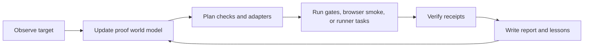

# ProofLoop Agent OS Markdown Pack

This pack is the human-readable operating system for ProofLoop. It gives users and coding agents a shared language for targets, claims, receipts, gates, workers, budgets, permissions, traces, and readiness.

ProofLoop is not trying to imitate consciousness. It copies the useful human workflow:

## Core Files

- [soul.md](soul.md) - product constitution and honesty boundary.
- [skills.md](skills.md) - verifier skills and expected inputs/outputs.
- [world.md](world.md) - ProofLoop world model schema.
- [loop.md](loop.md) - observe, target, plan, run, verify, report.
- [harness.md](harness.md) - runner, gates, receipts, and retries.
- [context.md](context.md) - what belongs in agent context.
- [memory.md](memory.md) - what gets persisted across runs.
- [goals.md](goals.md) - goal and claim semantics.
- [workers.md](workers.md) - worker lifecycle for command tasks and browser smoke.
- [delegation.md](delegation.md) - how external coding agents should be handed work.
- [permissions.md](permissions.md) - actions that need approval.
- [budget.md](budget.md) - cost, time, token, and task limits.
- [visibility.md](visibility.md) - user-facing state and reports.
- [interrupts.md](interrupts.md) - how steering changes the proof plan.
- [collaboration.md](collaboration.md) - human, agent, and CI roles.
- [artifact.md](artifact.md) - receipts, reports, traces, and deliverables.
- [evals.md](evals.md) - capability and regression checks.
- [failure-modes.md](failure-modes.md) - known ways agents fake done.
- [trace-schema.md](trace-schema.md) - event names for trace-compatible receipts.
- [readiness.md](readiness.md) - when ProofLoop can honestly say ready.
- [research.md](research.md) - research grounding for world-model and context engineering.

## Templates

- [templates/room-template.md](templates/room-template.md)
- [templates/skill-template.md](templates/skill-template.md)
- [templates/worker-template.md](templates/worker-template.md)
- [templates/eval-template.md](templates/eval-template.md)

